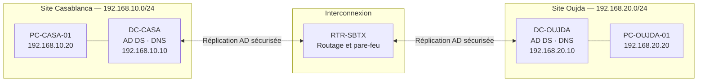

# 01 — Architecture cible

## Objectif

Concevoir une infrastructure Active Directory unique, répartie sur deux sites virtuels : Casablanca et Oujda. Chaque site dispose de son propre sous-réseau et d'un contrôleur de domaine.

## Vue d'ensemble

## Domaine Active Directory

| Élément | Valeur |
| --- | --- |
| Domaine de laboratoire | `ad.sbtx.lab` |
| Forêt Active Directory | Une forêt unique |
| Contrôleur principal | `DC-CASA` |
| Contrôleur secondaire | `DC-OUJDA` |
| Services sur les deux DC | AD DS, DNS, catalogue global |

## Machines virtuelles

| Machine | Site | Rôle | Ressources prévues |
| --- | --- | --- | --- |
| `DC-CASA` | Casablanca | Contrôleur de domaine principal | 4 Go RAM · 2 vCPU · 60 Go |
| `DC-OUJDA` | Oujda | Contrôleur de domaine secondaire | 4 Go RAM · 2 vCPU · 60 Go |
| `PC-CASA-01` | Casablanca | Poste client de test | 4 Go RAM · 2 vCPU · 50 Go |
| `PC-OUJDA-01` | Oujda | Poste client de test | 4 Go RAM · 2 vCPU · 50 Go |
| `RTR-SBTX` | Interconnexion | Routeur/pare-feu entre les deux sites | 1 Go RAM · 1 vCPU · 10 Go |

`RTR-SBTX` est ajouté afin de relier les deux sous-réseaux comme deux sites réels. Il ne remplace pas les contrôleurs de domaine et ne doit pas être joint au domaine.

## Plan d'adressage IP

### Site Casablanca

| Équipement | Adresse IP | Masque | Passerelle | DNS préféré |
| --- | --- | --- | --- | --- |
| `RTR-SBTX` — interface Casablanca | `192.168.10.1` | `/24` | — | — |
| `DC-CASA` | `192.168.10.10` | `/24` | `192.168.10.1` | `192.168.10.10` |
| `PC-CASA-01` | `192.168.10.20` | `/24` | `192.168.10.1` | `192.168.10.10` |

### Site Oujda

| Équipement | Adresse IP | Masque | Passerelle | DNS préféré |
| --- | --- | --- | --- | --- |
| `RTR-SBTX` — interface Oujda | `192.168.20.1` | `/24` | — | — |
| `DC-OUJDA` | `192.168.20.10` | `/24` | `192.168.20.1` | `192.168.20.10` |
| `PC-OUJDA-01` | `192.168.20.20` | `/24` | `192.168.20.1` | `192.168.20.10` |

## Réseaux VirtualBox

| Nom du réseau interne | Utilisation | Machines connectées |
| --- | --- | --- |
| `SBTX-CASA` | Réseau local du site Casablanca | `DC-CASA`, `PC-CASA-01`, `RTR-SBTX` |
| `SBTX-OUJDA` | Réseau local du site Oujda | `DC-OUJDA`, `PC-OUJDA-01`, `RTR-SBTX` |
| `NAT` | Accès Internet temporaire pour les mises à jour | `RTR-SBTX` uniquement |

## Principes de sécurité

- Les postes clients utilisent uniquement les DNS des contrôleurs de domaine.
- Les contrôleurs de domaine possèdent des adresses IP statiques.
- Le routeur filtre les communications entre les deux sites.
- La réplication Active Directory est testée après le déploiement de `DC-OUJDA`.
- Les droits d'accès seront attribués par groupes Active Directory, jamais utilisateur par utilisateur.

## Résultat attendu

À la fin de cette architecture, un utilisateur du site Casablanca ou Oujda pourra se connecter au même domaine `ad.sbtx.lab`, tout en restant rattaché à son site réseau.
