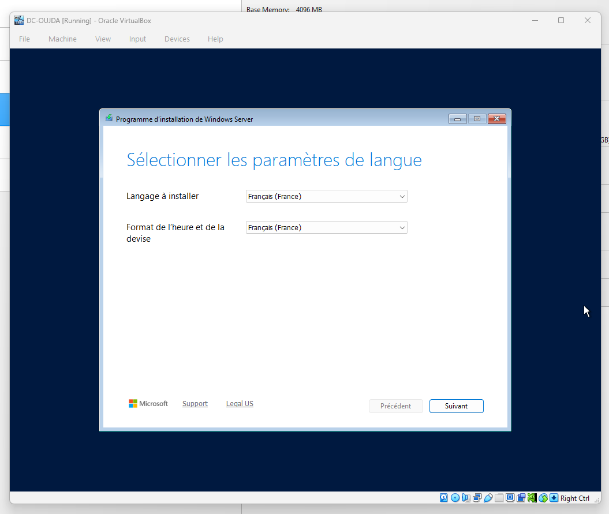
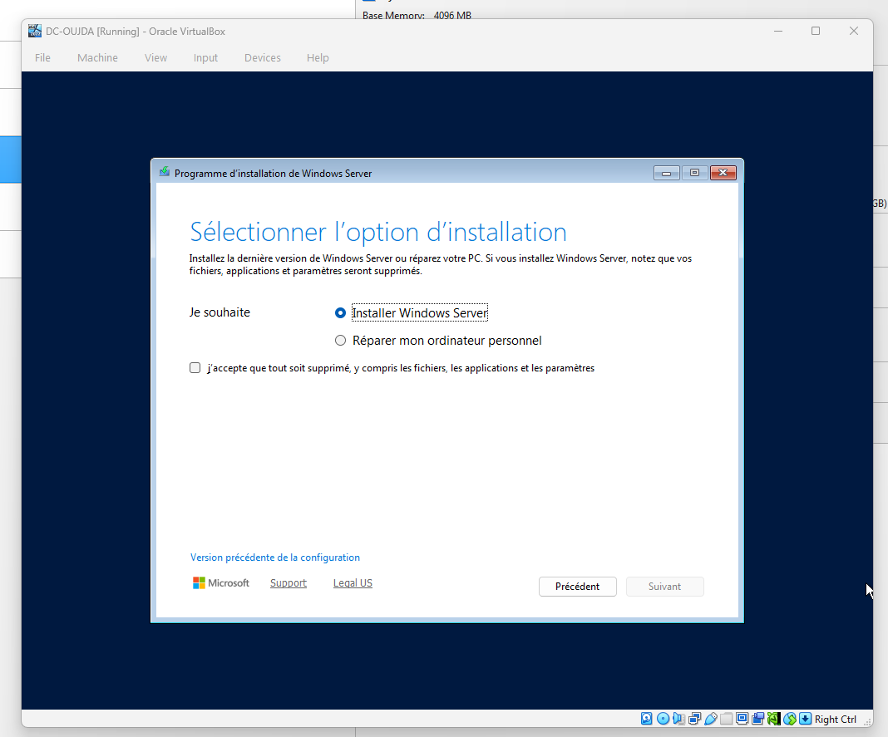
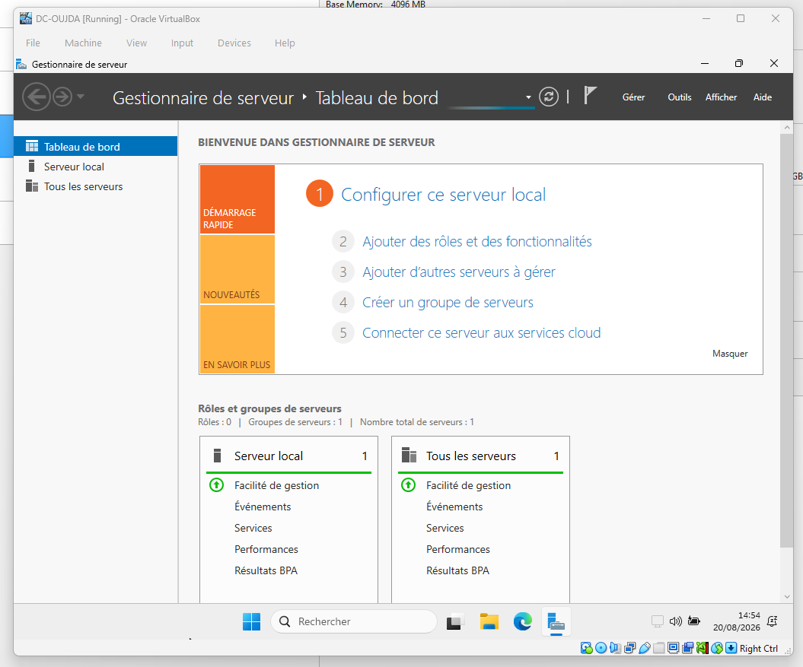
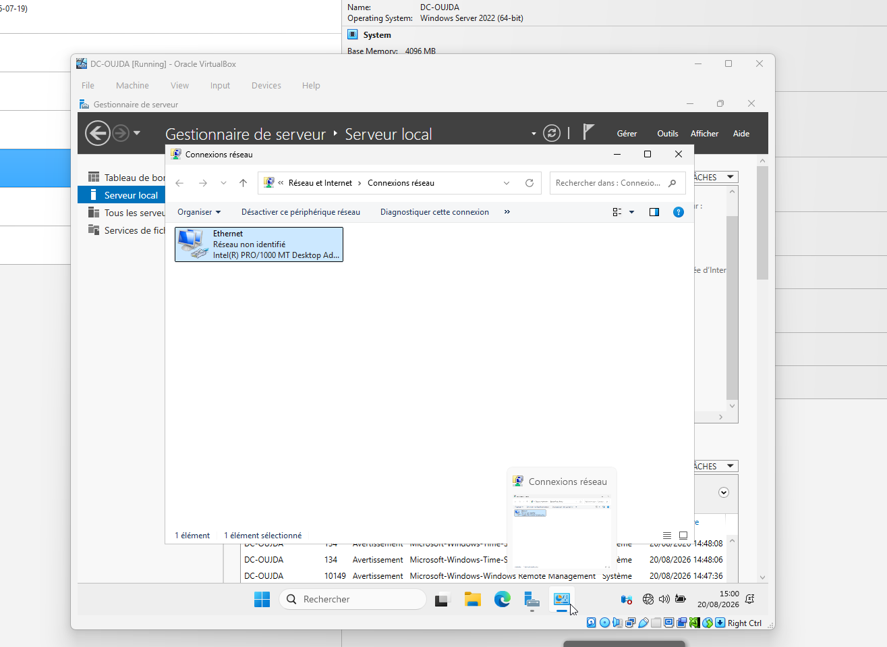
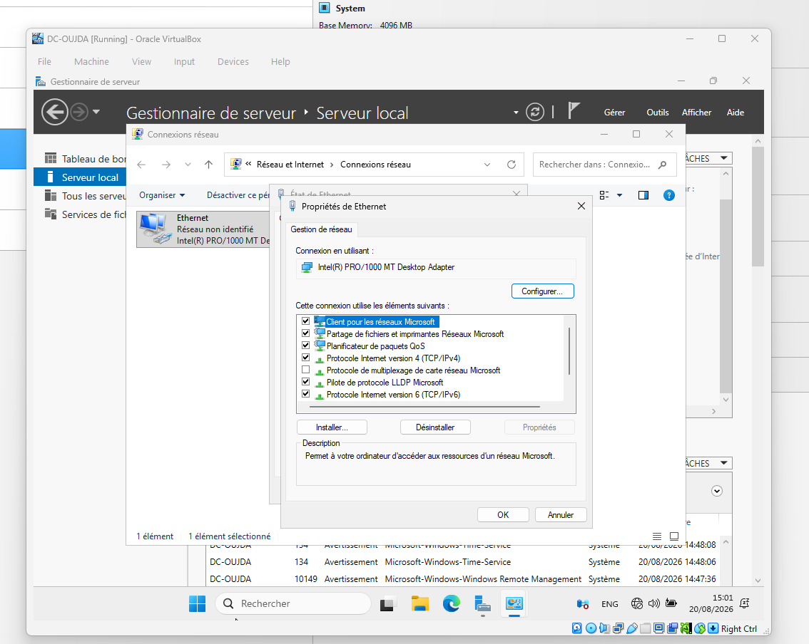
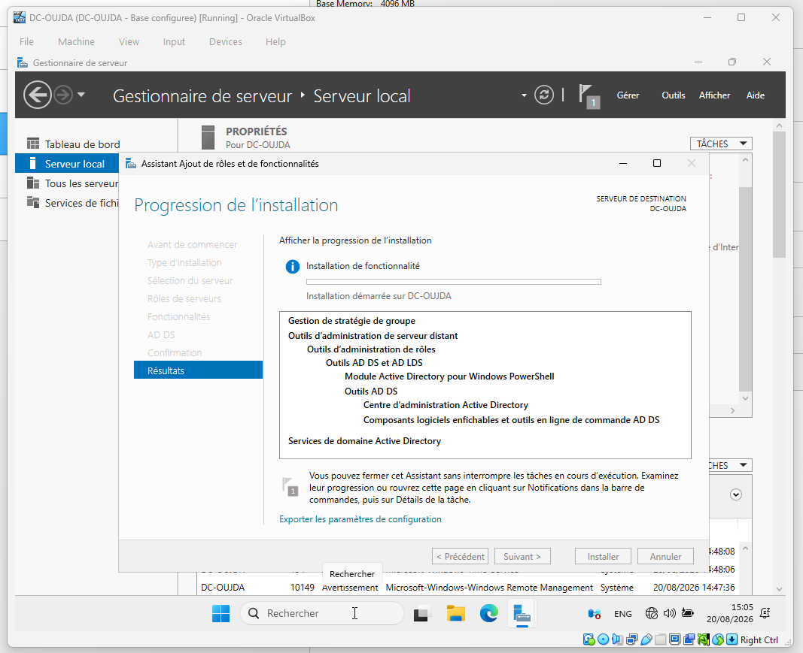

# Guide pas à pas — DC-OUJDA

## 1. Installer Windows Server

Choisir le français lors du démarrage de l'installateur Windows Server.



Choisir **Installer Windows Server**, accepter l'effacement du disque virtuel et continuer avec l'édition **Windows Server 2025 Standard Evaluation (expérience utilisateur)**.



Attendre la copie des fichiers et les redémarrages automatiques.


Après la première connexion, le Gestionnaire de serveur s'ouvre.



## 2. Renommer et configurer le réseau

Renommer l'ordinateur en `DC-OUJDA`, puis redémarrer. Dans le Gestionnaire de serveur, ouvrir **Serveur local**, puis le lien Ethernet pour accéder aux connexions réseau.



Faire un clic droit sur Ethernet, choisir **Propriétés**, sélectionner **Protocole Internet version 4 (TCP/IPv4)** et ouvrir ses propriétés.



Saisir les valeurs suivantes :

| Paramètre | Valeur |
| --- | --- |
| Adresse IPv4 | `192.168.20.10` |
| Masque | `255.255.255.0` |
| Passerelle | `192.168.20.1` |
| DNS préféré | `192.168.10.10` |

Vérifier avec `ipconfig /all` et `hostname`.


Créer l'instantané VirtualBox `DC-OUJDA - Base configuree`.

## 3. Installer le rôle AD DS

Dans le Gestionnaire de serveur, utiliser **Gérer > Ajouter des rôles et fonctionnalités**. Sélectionner l'installation basée sur un rôle, le serveur `DC-OUJDA`, puis cocher **Services de domaine Active Directory**. Accepter l'ajout des outils associés et lancer l'installation.



Après la fin de l'installation, vérifier le rôle dans PowerShell :

```powershell
Get-WindowsFeature AD-Domain-Services
```

L'état attendu est `Installed`. La commande `whoami` confirme ici que la session est encore celle de l'administrateur local ; le serveur n'a pas encore rejoint le domaine.


Créer l'instantané `DC-OUJDA - AD DS installe`, puis arrêter le serveur. La prochaine étape consiste à rendre le routage CASA ↔ OUJDA opérationnel avec OPNsense avant de promouvoir `DC-OUJDA` dans `ad.sbtx.lab`.
