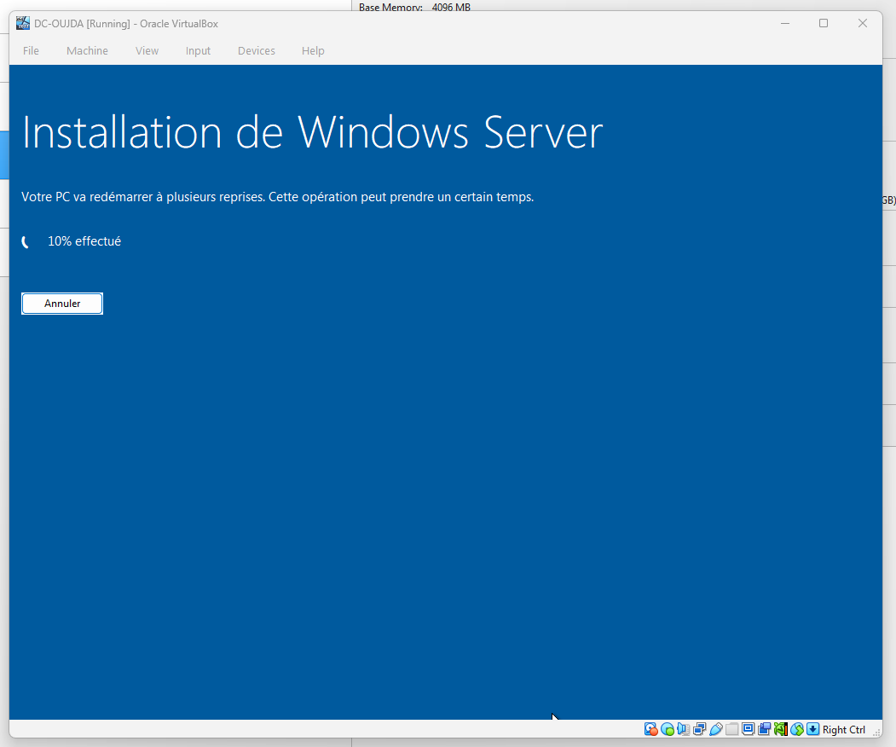
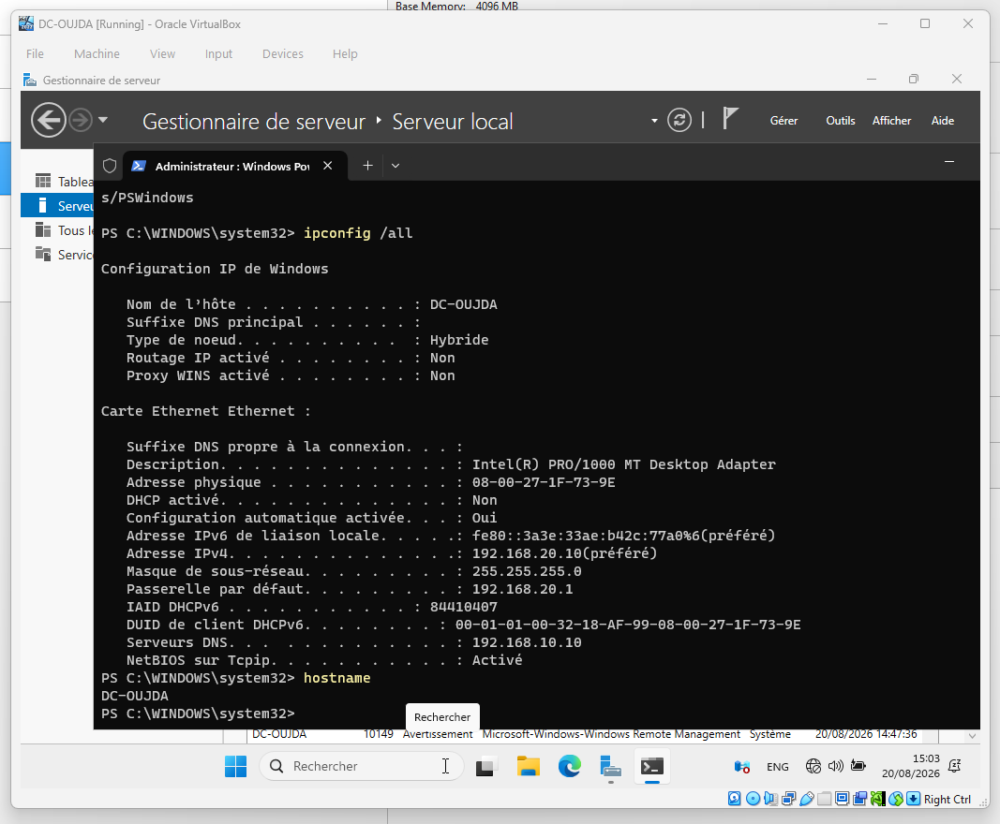
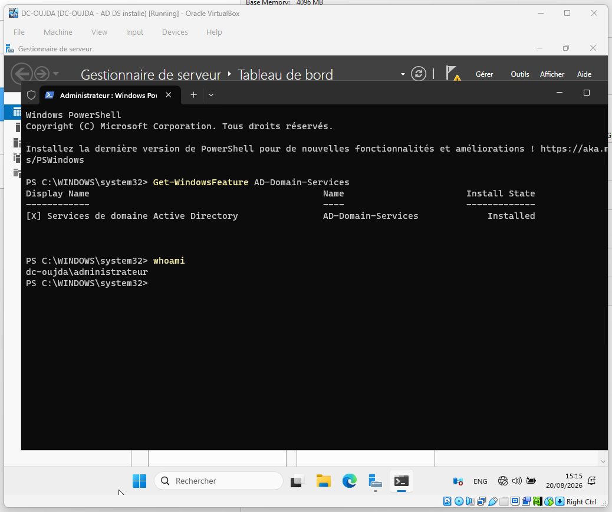

# 04 — DC-OUJDA : préparation du second contrôleur de domaine

Cette étape prépare `DC-OUJDA`, le futur contrôleur de domaine du site d'Oujda. Il rejoindra la forêt existante `ad.sbtx.lab` après la mise en service du routeur inter-sites.

## Résultat obtenu

| Élément | Valeur |
| --- | --- |
| Serveur | `DC-OUJDA` |
| Adresse IPv4 | `192.168.20.10/24` |
| Passerelle | `192.168.20.1` |
| DNS préféré | `192.168.10.10` |
| Rôle installé | AD DS |
| État de l'étape | Contrôleur de domaine secondaire opérationnel |

## Réalisation

1. Installation de Windows Server 2025 Standard Evaluation avec expérience utilisateur.
2. Renommage du serveur en `DC-OUJDA`.
3. Configuration de l'adresse IPv4 fixe du site d'Oujda.
4. Configuration du DNS sur `DC-CASA` (`192.168.10.10`).
5. Création de l'instantané `DC-OUJDA - Base configuree`.
6. Installation du rôle **Services de domaine Active Directory**.
7. Vérification du rôle avec `Get-WindowsFeature AD-Domain-Services`.
8. Création de l'instantané `DC-OUJDA - AD DS installe`.
9. Validation du routage et du DNS inter-sites via `RTR-SBTX`.
10. Promotion de `DC-OUJDA` comme contrôleur de domaine supplémentaire de `ad.sbtx.lab`.
11. Validation de la réplication Active Directory, puis création de l'instantané `DC-OUJDA - DC secondaire répliqué`.

## Point d'attention

`DC-OUJDA` a été promu comme **contrôleur de domaine supplémentaire** de `ad.sbtx.lab`, et non comme nouvelle forêt. Les sites logiques Casablanca et Oujda seront créés à l'étape 05.

## Preuves

## Documentation détaillée

Le déroulement illustré est disponible dans [GUIDE_PAS_A_PAS.md](GUIDE_PAS_A_PAS.md). La synthèse technique est disponible dans [NOTE.md](NOTE.md).
