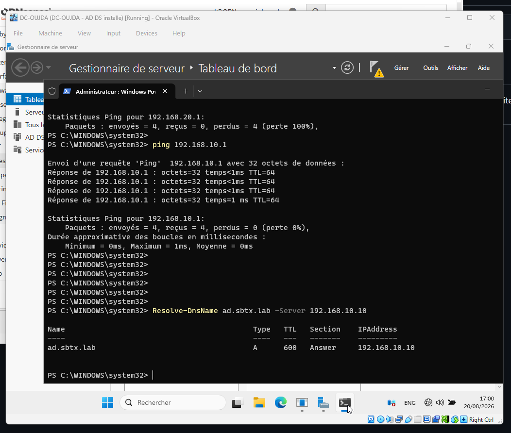
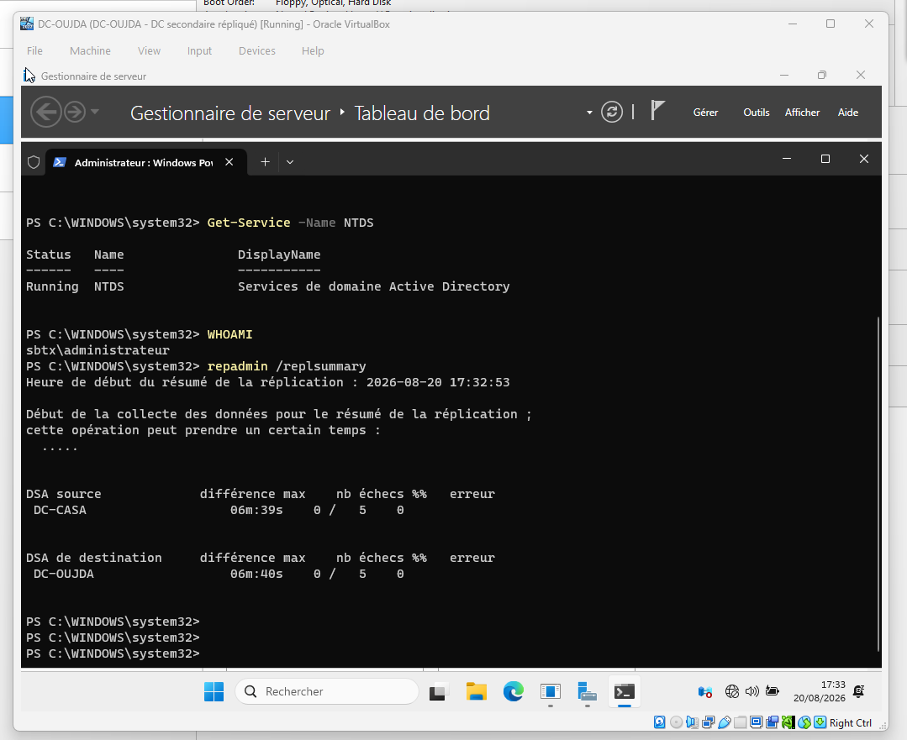

# 05 — Sites et réplication Active Directory

Cette étape organise la forêt `ad.sbtx.lab` selon les deux implantations de SBTX : Casablanca et Oujda.

## État actuel

La connectivité inter-sites et la réplication entre les deux contrôleurs de domaine sont validées. La création des objets **Sites**, des sous-réseaux et du lien de site reste à réaliser.

| Élément | État |
| --- | --- |
| DC-CASA | Contrôleur de domaine et DNS opérationnel — `192.168.10.10` |
| DC-OUJDA | Contrôleur de domaine secondaire et DNS opérationnel — `192.168.20.10` |
| Routage inter-sites | Opérationnel via `RTR-SBTX` |
| Résolution DNS depuis Oujda | Validée pour `ad.sbtx.lab` |
| Réplication Active Directory | Validée — 0 % d'échec |

## Preuves de validation

### Résolution DNS depuis Oujda

La commande `Resolve-DnsName ad.sbtx.lab -Server 192.168.10.10` retourne l'adresse de DC-CASA.

### Réplication Active Directory

La commande `repadmin /replsummary` affiche DC-CASA comme source et DC-OUJDA comme destination, sans erreur de réplication.

## Prochaine réalisation

1. Créer les sites `CASABLANCA` et `OUJDA` dans **Sites et services Active Directory**.
2. Associer `192.168.10.0/24` à Casablanca et `192.168.20.0/24` à Oujda.
3. Déplacer chaque contrôleur de domaine dans son site.
4. Configurer le lien de site et vérifier de nouveau la réplication.
